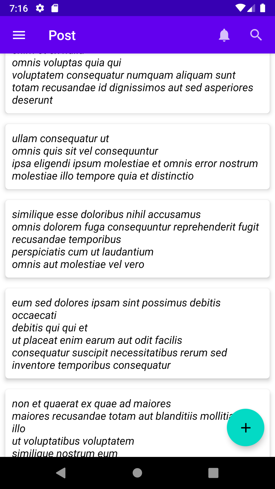

## Jetpack Compose App
- Android  application written with kotlin programming language.
- Consumes  jsonplaceholder API to fetch and display a list.
 

Minimum API level supported is: 24

 
- Build System: [Gradle](https://gradle.org)

## Table of Contents
-  [Prerequisite](#prerequisite)
-  [Architecture](#architecture)
-  [TechStack](#techstack)
-  [Screenshots](#screenshots)
 

## Prerequisite
- To run these application you need 
* Android Studio.
 

## Architecture
- These application is build using MVVM architecture to allow separation of concerns.

 

## TechStack
 * [Kotlin](https://developer.android.com/kotlin) - Cross-platform, statically type, general purpose programming language with type inference.
 * [Hilt](https://developer.android.com/training/dependency-injection/hilt-android) - Dependency injection library for android.
 * [Retrofit](https://square.github.io/retrofit/) - A Type-safe HTTP client for android and java used to consume REST APIs.
 * [Gson](https://github.com/google/gson) - Used to convert Json to java and kotlin objects.
 * [ViewModel](https://developer.android.com/topic/libraries/architecture/viewmodel) - Used to store and manage UI related data in a lifecycle concious way.
 * [Flow API](https://kotlinlang.org/docs/flow.html#sequences)  In coroutines, a flow is a type that can emit multiple values sequentially, as opposed to suspend functions that return only a single value.
 * [MockWebServer](https://kotlintesting.com/testing-retrofit-calls)  A mock web server is a program that mocks the behavior of an actual Retrofit API  but doesn’t make calls over the internet.It is used to Test Retrofit
 * [JUnit]  JUnit is a simple framework to write test the logic of program like Room database  , ViewModel and Repository.
 

